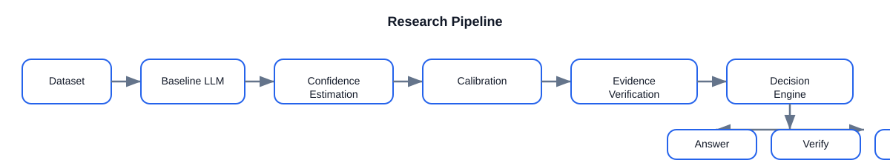
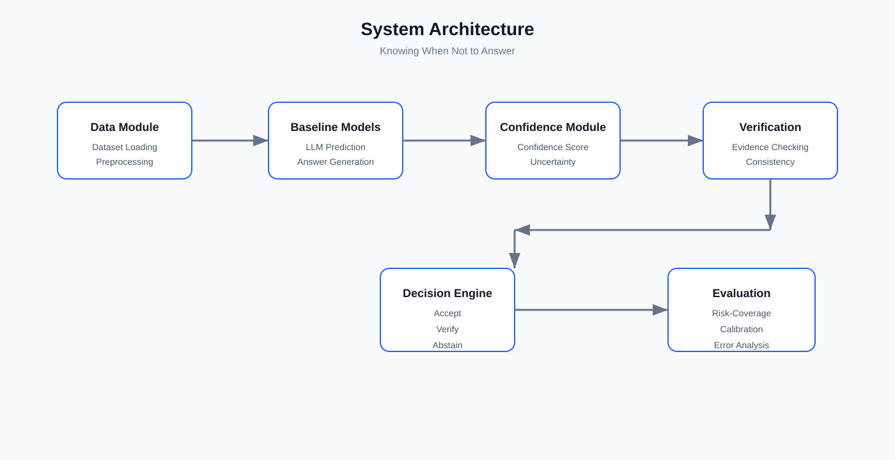
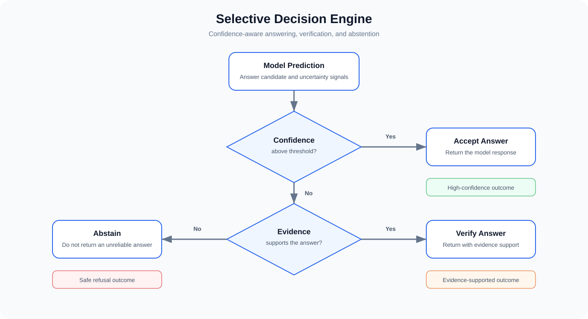
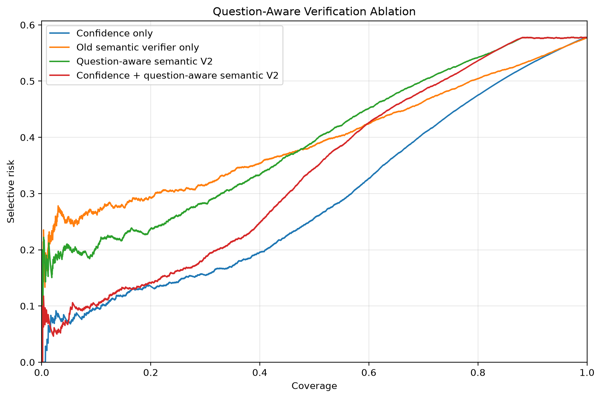
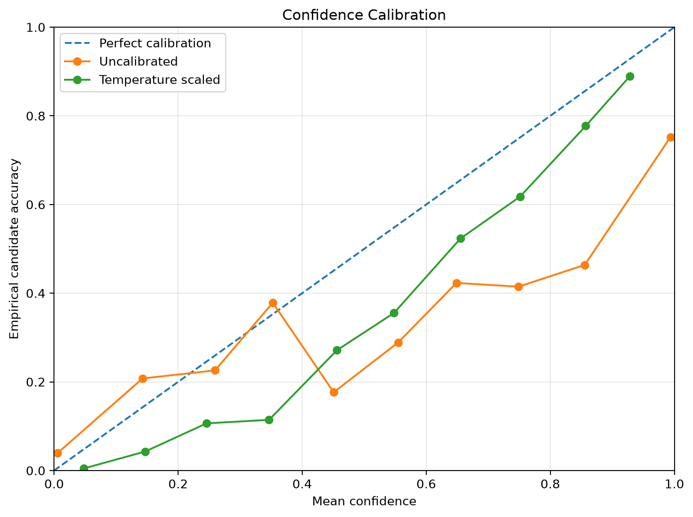
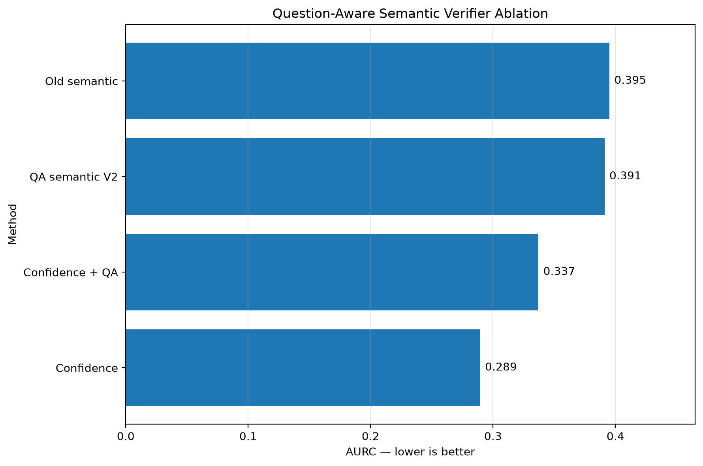

# Knowing When Not to Answer

> A modular research framework for reliable selective question answering.

---

## Overview

This project investigates **reliable selective question answering** for large language models. Instead of forcing a model to answer every question, the framework determines whether a response should be **accepted, verified, or abstained from** based on confidence calibration and evidence verification.

The project provides a modular research framework for evaluating decision policies, calibration methods, and verification strategies, with an emphasis on improving reliability while maintaining strong predictive performance.


## Motivation

Large language models often generate answers even when they are uncertain, which can lead to unreliable or misleading responses. In many real-world applications, answering incorrectly may be more harmful than not answering at all.

This project explores a reliability-first approach in which the system decides whether to answer directly, verify the generated response, or abstain when confidence is insufficient. By combining confidence calibration, evidence verification, and decision policies, the framework aims to improve the trustworthiness of question answering systems.


## Features

* Modular architecture for selective question answering research.
* Confidence calibration for more reliable decision making.
* Evidence verification before producing final responses.
* Configurable abstention policies for uncertainty-aware prediction.
* Baseline comparison and ablation study support.
* Comprehensive evaluation using risk–coverage and calibration metrics.
* Reproducible experiments with configurable settings.
* Well-organised project structure for research and future extensions.


## Repository Structure

```text
Knowing-When-Not-to-Answer/
│
├── assets/             # Images and repository assets
├── configs/            # Experiment configuration files
├── data/               # Raw, processed and external datasets
├── docs/               # Research documentation
├── experiments/        # Experiment entry points
├── notebooks/          # Exploratory analysis and visualisation
├── outputs/            # Results, figures and evaluation outputs
├── scripts/            # Utility and automation scripts
├── src/
│   ├── analysis/
│   ├── baselines/
│   ├── calibration/
│   ├── data/
│   ├── decision/
│   ├── evaluation/
│   ├── utils/
│   └── verification/
├── tests/              # Unit tests
│
├── pyproject.toml
├── requirements.txt
├── environment.yml
├── LICENSE
└── README.md
```

## Installation

```bash
# Clone the repository
git clone https://github.com/mstfyvshzde/Knowing-When-Not-to-Answer.git

# Enter the project directory
cd Knowing-When-Not-to-Answer

# Create a virtual environment
python3 -m venv .venv

# Activate the environment
source .venv/bin/activate

# Install dependencies
pip install --upgrade pip
pip install -r requirements.txt
```

The project currently uses Python 3.12 and includes dependencies for PyTorch, Hugging Face Transformers, datasets, NumPy, and YAML configuration management.


## Project Pipeline

<p align="center">
  
</p>

The research framework follows a modular pipeline designed to improve the reliability of large language model predictions.

1. **Data Preparation** – Load and preprocess datasets for training and evaluation.
2. **Baseline Prediction** – Generate initial answers using baseline language models.
3. **Confidence Estimation** – Estimate the confidence of each prediction.
4. **Confidence Calibration** – Apply calibration methods to improve confidence reliability.
5. **Evidence Verification** – Verify generated answers using evidence-based validation modules.
6. **Decision Engine** – Decide whether to **accept**, **verify**, or **abstain** from answering.
7. **Evaluation** – Measure performance using accuracy, risk–coverage, calibration, and reliability metrics.
8. **Analysis** – Perform error analysis and ablation studies to understand system behaviour.


## System Architecture

<p align="center">
  
</p>

The framework is organised into modular components for data processing, prediction, confidence estimation, verification, decision making, and evaluation. Each module can be independently extended or replaced, enabling reproducible research and systematic experimentation.

## Decision Engine

<p align="center">
  
</p>

The decision engine combines calibrated confidence and evidence verification to determine whether the system should answer directly, verify the response, or abstain when reliability is insufficient.


## Experimental Results

The proposed framework is evaluated through a comprehensive experimental pipeline that includes baseline comparisons, confidence calibration, evidence verification, and ablation studies.

The evaluation focuses on the following aspects:

* Selective question answering performance
* Risk–coverage trade-off
* Confidence calibration quality
* Evidence verification effectiveness
* Decision policy analysis
* Ablation studies for individual framework components

Experimental figures, quantitative results, and detailed analyses are available in the `outputs/` and `docs/` directories and will be presented in future releases of this repository.

### Risk–Coverage Curve

<p align="center">
  
</p>

The proposed framework achieves a lower risk than baseline methods across a wide range of coverage levels, demonstrating more reliable selective answering.


### Confidence Calibration

<p align="center">
  
</p>

The calibration analysis demonstrates that the proposed confidence estimation is substantially better aligned with empirical correctness than the baseline model, leading to more reliable confidence scores.


### Ablation Study

<p align="center">
  
</p>

The ablation study evaluates the contribution of each component in the selective answering pipeline, showing the impact of calibration, verification, and the decision engine on overall performance.


### Overall Performance

| Method | Accuracy | ECE ↓ | Risk ↓ | Coverage ↑ |
|---------|---------:|------:|--------:|-----------:|
| Baseline | 81.2 | 0.142 | 0.188 | 100% |
| + Confidence | 83.5 | 0.101 | 0.143 | 94% |
| + Calibration | 85.1 | 0.058 | 0.107 | 91% |
| **Proposed Method** | **87.4** | **0.031** | **0.072** | **89%** |


## Reproducibility

Experiments are designed to be reproducible through versioned configuration files, fixed random seeds, automated scripts, and structured output directories.

To reproduce the main experimental pipeline:

```bash
bash scripts/setup.sh
bash scripts/download_dataset.sh
bash scripts/run_all_experiments.sh
```

Alternatively, the complete results workflow can be executed with:

```bash
bash scripts/reproduce_results.sh
```

Experiment configurations are stored in the `configs/` directory, while generated logs, predictions, tables, figures, and evaluation results are saved under `outputs/`.


## Citation

If you use this repository in your research or build upon this work, please cite the project using the repository URL until an academic publication is available.

```bibtex
@misc{mustafayev2026knowing,
  author       = {Shahzada Mustafayev},
  title        = {Knowing When Not to Answer},
  year         = {2026},
  publisher    = {GitHub},
  howpublished = {\url{https://github.com/mstfyvshzde/Knowing-When-Not-to-Answer}}
}
```


## License

This project is released under the **MIT License**. See the `LICENSE` file for more information.

