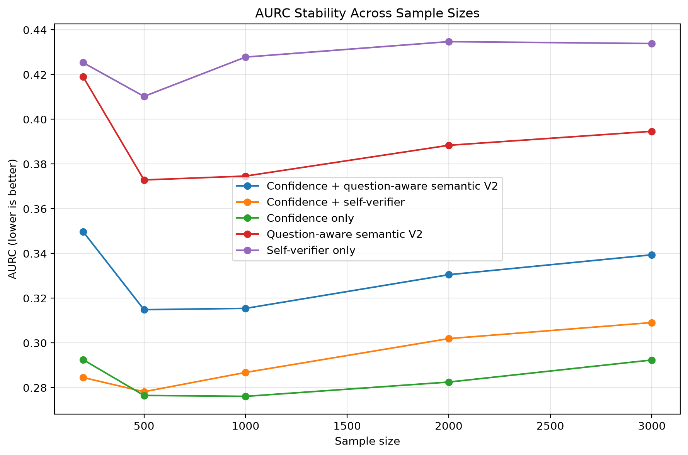
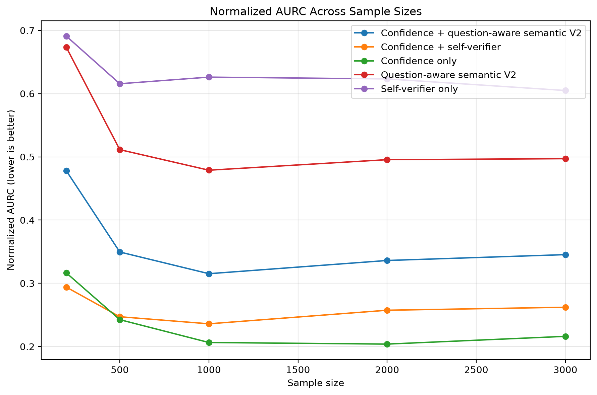

# Knowing When Not to Answer

[](https://github.com/mstfyvshzde/Knowing-When-Not-to-Answer/actions/workflows/tests.yml)

> A modular research framework for reliable selective question answering.

---

## Overview

This project investigates **reliable selective question answering** for pretrained transformer-based QA systems. Instead of forcing a QA model to answer every question, the framework evaluates whether a prediction should be **accepted, verified, or abstained from** based on confidence calibration and evidence verification.

The project provides a modular research framework for evaluating decision policies, calibration methods, and verification strategies, with an emphasis on improving reliability while maintaining strong predictive performance.


## Motivation

Question-answering models can produce incorrect answers even when their prediction scores appear confident. In many real-world applications, answering incorrectly may be more harmful than abstaining when reliability is insufficient.

This project explores a reliability-first approach in which the system decides whether to answer directly, verify the generated response, or abstain when confidence is insufficient. By combining confidence calibration, evidence verification, and decision policies, the framework aims to improve the trustworthiness of question answering systems.


## Features

* Modular architecture for selective question answering research.
* Confidence calibration for more reliable decision making.
* Evidence verification before producing final responses.
* Configurable abstention policies for uncertainty-aware prediction.
* Baseline comparison and ablation study support.
* Comprehensive evaluation using risk–coverage and calibration metrics.
* Reproducible experiments with configurable settings.
* Well-organised project structure for research and future extensions.


## Repository Structure

```text
Knowing-When-Not-to-Answer/
│
├── assets/             # Images and repository assets
├── configs/            # Experiment configuration files
├── data/               # Raw, processed and external datasets
├── docs/               # Research documentation
├── experiments/        # Experiment entry points
├── notebooks/          # Exploratory analysis and visualisation
├── outputs/            # Results, figures and evaluation outputs
├── scripts/            # Utility and automation scripts
├── src/
│   ├── analysis/
│   ├── baselines/
│   ├── calibration/
│   ├── data/
│   ├── decision/
│   ├── evaluation/
│   ├── utils/
│   └── verification/
├── tests/              # Unit tests
│
├── pyproject.toml
├── requirements.txt
├── environment.yml
├── LICENSE
└── README.md
```

## Installation

```bash
# Clone the repository
git clone https://github.com/mstfyvshzde/Knowing-When-Not-to-Answer.git

# Enter the project directory
cd Knowing-When-Not-to-Answer

# Create a virtual environment
python3 -m venv .venv

# Activate the environment
source .venv/bin/activate

# Install dependencies
pip install --upgrade pip
pip install -r requirements.txt
```

The project currently uses Python 3.12 and includes dependencies for PyTorch, Hugging Face Transformers, datasets, NumPy, and YAML configuration management.


## Project Pipeline

<p align="center">
  
</p>

The research framework follows a modular pipeline for studying the reliability of selective question-answering predictions.

1. **Data Preparation** – Load and preprocess datasets for training and evaluation.
2. **Baseline Prediction** – Generate extractive answers using the pretrained QA baseline.
3. **Confidence Estimation** – Estimate the confidence of each prediction.
4. **Confidence Calibration** – Apply calibration methods to improve confidence reliability.
5. **Evidence Verification** – Verify generated answers using evidence-based validation modules.
6. **Decision Engine** – Decide whether to **accept**, **verify**, or **abstain** from answering.
7. **Evaluation** – Measure performance using accuracy, risk–coverage, calibration, and reliability metrics.
8. **Analysis** – Perform error analysis and ablation studies to understand system behaviour.


## System Architecture

<p align="center">
  
</p>

The framework is organised into modular components for data processing, prediction, confidence estimation, verification, decision making, and evaluation. Each module can be independently extended or replaced, enabling reproducible research and systematic experimentation.

## Decision Engine

<p align="center">
  
</p>

The decision engine is an earlier prototype component for exploring ANSWER / VERIFY / ABSTAIN policies. It is not part of the final held-out evaluation reported in this repository; the final experiments compare ranking signals directly using risk-coverage metrics.

## Experimental Results

### Final Held-Out Evaluation

The final evaluation uses **3,000 held-out SQuAD v2 test examples**. Confidence calibration is fitted only on the calibration split and then frozen before test evaluation. The same deterministic ordering is used for nested subsets of **200, 500, 1,000, 2,000, and 3,000 examples** with seed 17.

Selective prediction quality is measured primarily with the **Area Under the Risk-Coverage Curve (AURC)**, where lower values are better.

| Method | AURC | Normalized AURC | Delta AURC vs. Confidence | 95% Paired Bootstrap CI |
|---|---:|---:|---:|---:|
| **Confidence only** | **0.292379** | **0.218555** | — | — |
| Confidence + self-verifier | 0.309120 | 0.262110 | +0.016741 | [0.008561, 0.024773] |
| Confidence + question-aware semantic V2 | 0.339417 | 0.347915 | +0.047038 | [0.036347, 0.057295] |
| Question-aware semantic V2 | 0.394397 | 0.498982 | +0.102019 | [0.086097, 0.118102] |
| Self-verifier only | 0.433892 | 0.604947 | +0.141513 | [0.124280, 0.159087] |

Confidence only achieved the lowest AURC at N=500, 1000, 2000, and 3000; at N=200, confidence + self-verifier was slightly better (0.284548 vs 0.292532). Adding either question-aware semantic verification or self-verification did not improve overall selective ranking over the calibrated confidence baseline.

The uncertainty analysis uses **5,000 paired bootstrap resamples** of the same held-out predictions. Positive Delta AURC means the compared method performs worse than confidence-only. All four paired confidence intervals remain above zero, supporting the stability of the confidence-only advantage on this test set.

Some individual coverage points show small local reversals, but these do not change the overall AURC ranking. The main result is therefore a negative but informative finding: **additional verification signals do not necessarily improve selective QA ranking when the confidence baseline is already strong and calibrated.**





### Confidence Calibration

Temperature scaling is fitted on the calibration split only and is never refitted using held-out test labels.

The learned temperature is **4.604539**. On the calibration split, negative log-likelihood decreased from **0.966913** before scaling to **0.412469** after scaling. The fitted temperature is then frozen and applied to test predictions.

### Interpretation

The results do not show that semantic or self-verification is useless in general. They show a narrower result for this experimental setting: with a pretrained extractive QA model on SQuAD v2, the evaluated verification signals did not outperform calibrated confidence for global selective ranking.

This distinction is important because the verification signals may still provide useful diagnostic information or local improvements at particular coverage levels.

## Reproducibility

The final experiments are designed to be reproducible through fixed dataset splits, deterministic seeds, frozen calibration parameters, automated scripts, and versioned result artifacts.

The reference experimental environment used for the final results is:

- Python **3.12.13**
- Exact installed package versions: `requirements-lock.txt`
- Supported dependency ranges: `requirements.txt`
- Final evaluation ordering seed: **17**
- Bootstrap seed: **17**
- Paired bootstrap resamples: **5,000**

The SQuAD v2 validation data is split into separate **calibration** and **held-out test** partitions. Temperature scaling is fitted on the calibration split only and the learned temperature is frozen before test evaluation. Test labels are not used to tune calibration parameters or ranking rules.

To prepare the dataset:

```bash
bash scripts/download_dataset.sh
```

To run the final experiment pipeline:

```bash
DEVICE=cpu LIMIT=3000 bash scripts/run_all_experiments.sh
```

`DEVICE` may be changed to `mps` or `cuda` when supported by the local PyTorch installation.

To execute the complete reproducibility workflow, including dataset preparation, experiments, bootstrap uncertainty analysis, linting, and tests:

```bash
DEVICE=cpu LIMIT=3000 bash scripts/reproduce_results.sh
```

The final lightweight evaluation artifacts are stored under:

```text
outputs/evaluation/final_sample_size_comparison/
```

Large intermediate predictions and reproducible nested `subset.jsonl` files are intentionally excluded from version control.

## Citation

If you use this repository in your research or build upon this work, please cite the project using the repository URL until an academic publication is available.

```bibtex
@misc{mustafayev2026knowing,
  author    = {Shahzada Mustafayev},
  title     = {Knowing When Not to Answer},
  year      = {2026},
  publisher = {GitHub},
  url       = {https://github.com/mstfyvshzde/Knowing-When-Not-to-Answer}
}
```

## License

This project is released under the **MIT License**. See the `LICENSE` file for more information.

